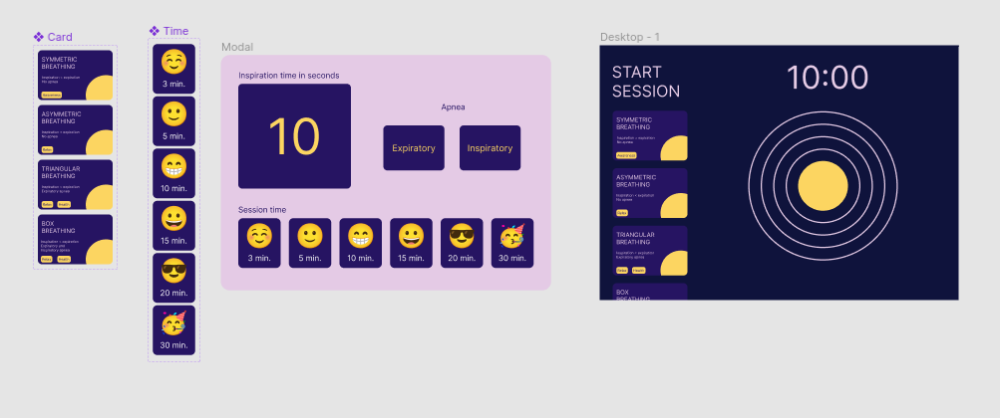

#BreathingApp

Introducing BreathingApp, your daily companion for stress relief and mindfulness. Designed for desk workers, it offers quick breaks to escape daily stress. Harness the power of deep breathing to relax and rejuvenate your mind. With BreathingApp, you can find moments of calm in your hectic day, promoting well-being and productivity. Take a breath, take a break, and take control of your workday stress with BreathingApp.

## Figma Sketch

Initial Figma sketch:

Link to the updated Figma project: 

https://www.figma.com/file/0HJHHtXcy1nXp1qhOyox4Z/Figma-basics?type=design&node-id=1669%3A162202&mode=design&t=sHMKXnMuTIC7bwlq-1

Link to the Figma prototype: 

https://www.figma.com/proto/0HJHHtXcy1nXp1qhOyox4Z/Figma-basics?type=design&node-id=502-14&t=1tztJCrT7Jzm5NkQ-1&scaling=scale-down&page-id=1669%3A162202&starting-point-node-id=502%3A14&mode=design

