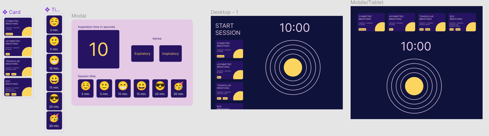
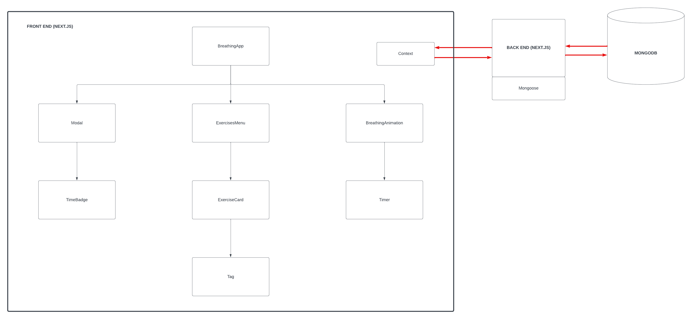

# BreathingApp

Introducing BreathingApp, your daily companion for stress relief and mindfulness.

Designed for desk workers, it offers quick breaks to escape daily stress. Harness the power of deep breathing to relax and rejuvenate your mind.
With BreathingApp, you can find moments of calm in your hectic day, promoting well-being and productivity.

Take a breath, take a break, and take control of your workday stress with BreathingApp.

Link to the deployed app:

https://breathing-app-ecru.vercel.app/

## Features

- Deep Breathing Exercises: the app offers a variety of deep breathing exercises to choose from, each with different patterns and durations.

- Meditation Timer: set a timer for your meditation sessions and immerse yourself in a state of mindfulness.

- Animation: engage with captivating animations that guide your breathing rhythm, enhancing the meditation experience.

## Technology stack

### Front end

- Next.js

- TypeScript to ensure code quality and type safety.

- React Hooks such as 'useState', 'useEffect', and 'useContext' for managing state and interactions.

- Tailwind CSS for utility classes.

- module.css for component-specific styles.

- GreenSock (GSAP) for creating smooth and interactive animations.

### Back end

- TypeScript for maintainability and robustness.

- Next.js, which provides API routes to handle data.

- MongoDB is used as the database to store data.

- Mongoose is employed to define and manipulate data models.

## About the process

### UI with Figma :

Link to the updated Figma project:

https://www.figma.com/file/0HJHHtXcy1nXp1qhOyox4Z/Figma-basics?type=design&node-id=1669%3A162202&mode=design&t=sHMKXnMuTIC7bwlq-1

Link to the Figma prototype:

https://www.figma.com/proto/0HJHHtXcy1nXp1qhOyox4Z/Figma-basics?type=design&node-id=502-14&t=1tztJCrT7Jzm5NkQ-1&scaling=scale-down&page-id=1669%3A162202&starting-point-node-id=502%3A14&mode=design

### App diagram with Lucidchart

Link to the updated app diagram:

https://lucid.app/lucidchart/5f50d6b6-9677-4e96-b8fe-c5b36c748d6b/edit?viewport_loc=-431%2C77%2C4281%2C2073%2C0_0&invitationId=inv_b34484e4-24be-471b-a40e-0dd165669795
